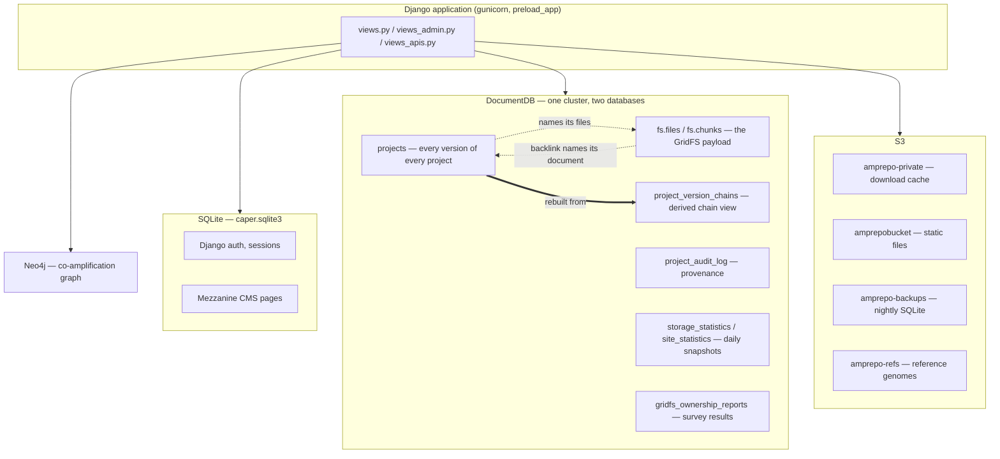
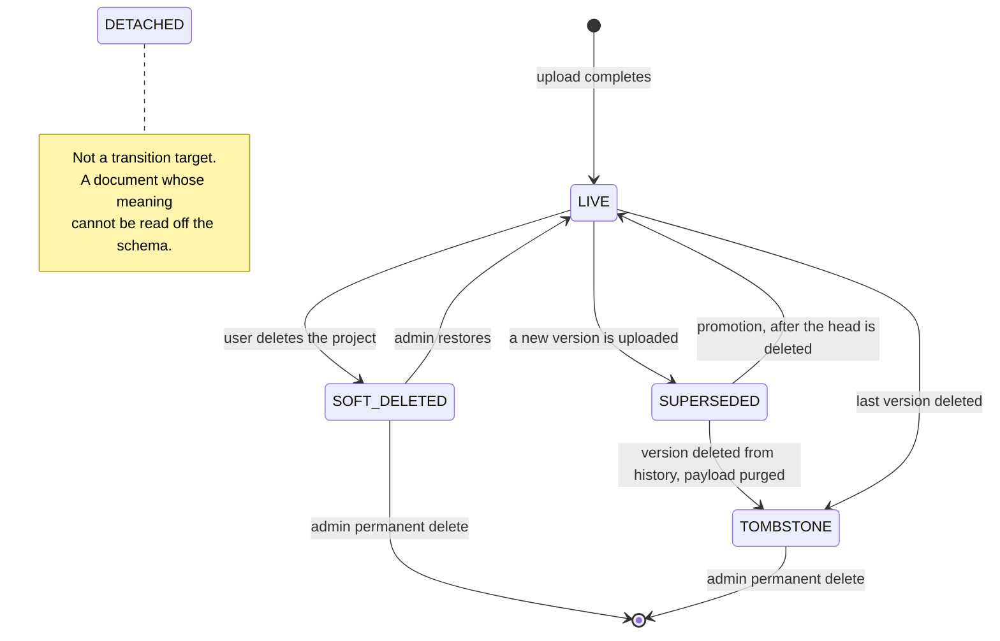
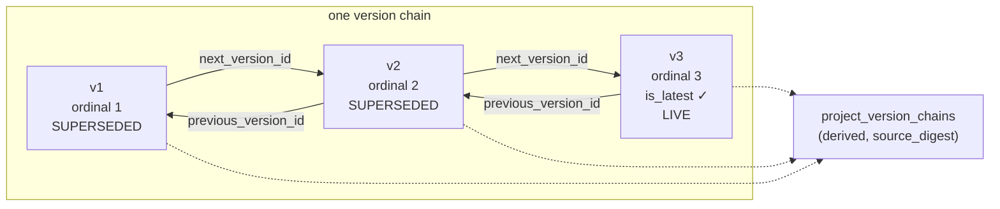
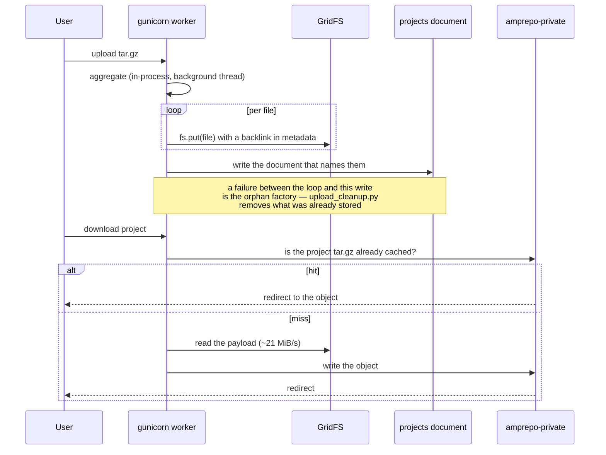
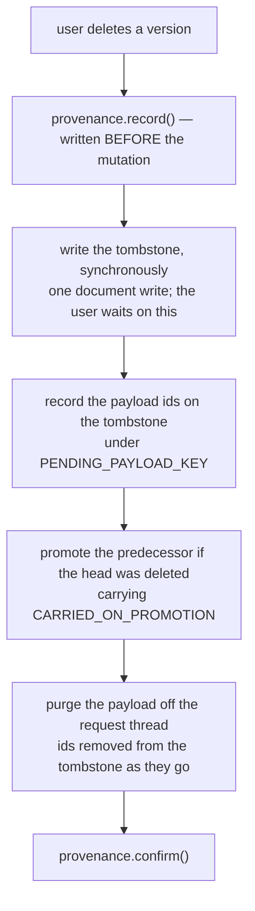

# The backend, and the tools that keep it honest

Written 2026-09-02, at the close of the storage-and-lineage work that runs from
tag `v3.1.0_082426` to release 4.0.0 — 135 files, 22 new application modules,
20 new operational scripts, 42 new test files.

This is the map. It says what the stores are, what a project document is, how a
version chain is encoded, where the bytes go, and which tool answers which
question. It does not repeat the modules: each one carries its own reasoning in
its docstring, and those are the primary source. What is here is the shape they
fit into and the pointers between them.

Read [AGENTS.md](../AGENTS.md) first for environment setup and the data model,
and [CLAUDE.md](../CLAUDE.md) for the discipline this codebase demands before a
claim about the data is written down anywhere. The short version of that
discipline, because everything below depends on it: **name the falsifying
measurement and run it before the claim goes into a comment, a commit message
or a report.** Every number in this document is dated and scoped for that
reason.

---

## 1. The stores

Four systems hold state, and only one of them is the authority for project data.



Two properties of this picture are load-bearing and are asserted by tests:

**Authority runs documents → files, never the other way round.** A GridFS file
is retained because a retained project document names it. The backlink in
`fs.files.metadata` is an index into that fact, so that "is *this one file*
orphaned?" can be a `find_one` instead of a traversal of every document. It is
provenance and never authority: nothing may delete a file because the file's own
metadata says it is unowned. See `gridfs_backlinks.py` and
`gridfs_ownership.py`, which compute the same answer by deliberately different
routes so that their agreement means something.

**`project_version_chains` is a materialised view.** Feature code reads it; only
the rebuild writes it; the documents always win. A `source_digest` makes
staleness a one-string comparison rather than a field-by-field diff. See
`version_chains.py`.

The two databases — `caper` (prod) and `caper-dev` (dev) — **share one cluster**.
Anything that connects must assert which one it opened. The dev application
credential is scoped to `caper-dev` and raises `OperationFailure` on `caper`,
which is a guard rail rather than an obstacle: prod measurements run from the
prod container.

---

## 2. A project document is two things wearing one shape

It is a **version** — one aggregation run, its samples, its tool versions, its
payload — and it is the **project** that owns that version: name, members,
visibility, alias, counters.

That distinction is not cosmetic. When a version is deleted and an older one
promoted in its place, promotion has to decide which half the promoted document
inherits. It used to decide by a hand-written list of nine field names;
`downloads` was on it and `project_downloads` was not, and the counter reset
every time a version was deleted.

`project_fields.py` is the declaration that list should have been, and promotion
reads it rather than a literal. **The test for which level a field belongs to is
not its name and not taste: a field is chain-level exactly when it must survive
the deletion of every version.**

| level | examples | on promotion |
|---|---|---|
| chain-level | `project_name`, `project_members`, `private`, `alias_name`, `featured`, `privateKey` | carried |
| chain-level, kept where earned | `project_downloads`, `sample_downloads`, `downloads` | **not** carried — summed across the chain when read |
| version-level | `runs`, `samples`, tool versions, GridFS keys | never carried |

The counters are the interesting case. They are chain-level facts stored per
version, so the head alone under-reports. Measured on prod 2026-08-29 across the
45 chains with more than one version: `project_downloads` showed 627 at the
heads against 7,459 earned by the chains — 92% never displayed. `download_totals.py`
sums the chain at read time rather than moving the numbers.

---

## 3. The five statuses

`project_status.py` is the single authority for "what is this document". Before
it, 72 call sites answered that question themselves in 21 distinct query shapes,
and both production incidents on record were the same failure: a predicate that
lives in the application, re-derived somewhere else, drifted.



| status | reachable by URL? | payload | meaning |
|---|---|---|---|
| `LIVE` | yes | retained | current head of a chain |
| `SUPERSEDED` | **yes** | retained | an earlier version — published links must keep working |
| `SOFT_DELETED` | no | retained | user-deleted, restorable from the admin page |
| `TOMBSTONE` | yes, as a redirect | purged | removed from history |
| `DETACHED` | varies | retained | meaning undetermined; a named state so the population is countable |

Every status is derived from one table of `(delete, current)` flag pairs plus
the tombstone markers, so the classifier, the Mongo filters and the values
written on a change cannot drift from each other. A grep guard in
`tests/test_project_status_guard.py` keeps `delete` and `current` from being
spelled by hand outside the module.

**`SUPERSEDED` documents are load-bearing.** They serve published results, and
"not the head of a chain" is never a reason to delete anything.

---

## 4. Lineage: three axes that are deliberately independent

A chain is encoded twice, and both encodings are still written.



**Pointers are structure, `is_latest` is position, status is state.** Those three
answer different questions and are not required to agree:

- **structure** — `version_chain_id`, `previous_version_id`, `next_version_id`,
  `version_ordinal`: which documents belong together, and in what order.
- **position** — `is_latest`: which one the site presents as current. Promotion
  moves it backwards along a chain whose pointers do not change.
- **state** — `classify()`: what each document is.

The older encoding, the denormalised `previous_versions[]` array, is cumulative:
every version carries the whole ancestry, so two documents naming the same
ancestor is normal and is not a fork. Since 2026-09-02 the site reads history
from the pointers only; the array fallback was removed once both databases were
fully pointered (`caper` 242/242 and `caper-dev` 160/160 as of 2026-09-02).

Every query that used to ask `{'previous_versions.linkid': <id>}` — a scan of an
array on every document in the collection — is now an equality match on
`version_chain_id`.

The independence of the three axes is a decision, not an oversight, and it has a
visible failure mode: the "you are viewing an older version" banner reads
`is_latest` alone, so a document that is `LIVE` but not flagged renders the
banner and links elsewhere. Invariant I7 catches the shape that produces it
(1 chain of 88 on dev, **0 of 153 on prod**, measured 2026-09-02).

---

## 5. The life of a payload



Two measured facts shape everything on this path.

**Regeneration is recoverable but not free.** A cache miss rebuilds inside the
request at about 21 MiB/s, so the largest cached project (5.81 GiB) is roughly
277 s of a blocked worker against gunicorn's 900 s ceiling. That is why nothing
expires cached objects by age or size, and why a sweep touches only objects
nothing can ever ask for again.

**Failed uploads, not deletions, are what strands files.** TCGA_Sarcoma's failed
upload of 2026-08-14 left 2,695 files inside a 90-second window.
`upload_cleanup.py` closes the case where an exception runs the failure path;
a worker that is *killed* runs no failure path at all, and the weekly
`cleanup_failed_upload_residue.py` sweep is the backstop for that. That split is
the right architecture rather than a gap: only something that runs later can
collect after a crash.

---

## 6. Deletion, and why the order changed

Deleting a version used to purge the GridFS payload first and write the
tombstone afterwards, inside the web request. A payload can take longer to
delete than a request is allowed to live — about `96.4 × GiB + 0.035 × files`
seconds, against a 900 s worker timeout — and a killed worker writes no
traceback.

Measured on dev 2026-09-02, deleting version 2 of a five-version PCAWG chain:
the event was recorded at 16:49:30, the worker was killed at 17:04:31 (901 s),
**15,272 of 15,733 files were deleted**, and the document was left classified
`SUPERSEDED` with no tombstone markers. The site presented an ordinary older
version whose payload was 97% gone, and nothing was looking for that state.



Three consequences worth knowing:

- **The tombstone carries the ids.** A tombstone is built fresh and does not
  inherit the payload keys, so once it is written nothing else knows which files
  that version owned. Recording them on the tombstone makes an interrupted purge
  resumable *by name*, rather than a matter for a global orphan sweep.
- **Provenance is written before the mutation, and never raises.** An event with
  `completed` unset is the signature of an operation that started and did not
  finish — the only way to tell that apart from one that never started. Because
  the writes are swallowed on failure, the log is evidence and never authority:
  do not build a check that assumes an event exists for every mutation.
- **A single `delete_many` per chunk range times out on large files.** That
  reports failure for a delete that in fact succeeded.

---

## 7. The maintenance toolkit

Four kinds of tool, and the kind matters more than the name. **Nothing in the
first two columns writes.**

### Surveyors — report only, never delete

| tool | the question it answers |
|---|---|
| `report_gridfs_orphans.py` | Account for every GridFS file. Read-only, always. |
| `caper/ownership_survey.py` + `manage.py ownership_survey` | Which project owns each file, and how much is residue. Runs outside a web worker. |
| `caper/storage_stats.py` + `snapshot_storage.py` | What the databases hold, by status bucket, once a day, with history. |
| `check_volume_reclamation.py` | Did deleted storage actually come back? (Measured answer: no — see §9.) |
| `compare_version_history.py` | Diff the two version-history readers over every project. |
| `dump_metadata.py` | Every collection except the payload, for an off-AWS copy. |
| `caper/url_manifest.py` | Every project URL that resolves today, and to what. |
| `check_project_flags.py` | The legacy flag pairs, per document. |

### Validators — assert invariants

| tool | the question it answers |
|---|---|
| `validate_project_lineage.py` | 21 invariants over version history. I7 catches a LIVE document listed in another's history; I9 catches a stale chain view; I11 catches array/pointer disagreement; I12–I14 need GridFS and are skipped under `--skip-gridfs`. |
| `caper/schema_validate.py` | JSON-schema validation of project documents. |
| `verify_indexes.py` | The indexes the query plans assume. |

### Sweepers — these delete. Report-only by default.

| tool | scope | the guard that makes it safe |
|---|---|---|
| `sweep_gridfs_unreferenced.py` | GridFS files no document references | acts on a reviewed snapshot, not a fresh count |
| `sweep_s3_unreferenced.py` | S3 objects no document in **any** database references | `--require-databases` refuses to run without an id set per database; objects are listed *before* ids are read, so a project created in between counts as referenced |
| `cleanup_failed_upload_residue.py` | files a failed ingestion left behind | selects by metadata only within the narrow window where that is sound |
| `clear_stale_uploads.py` | upload placeholders that crashed before becoming projects | finds them by owner, never by date |
| `cleanup_orphaned_projects.py` | documents no resolver can reach | protection rules derived from `project_status`, not re-typed |
| `purge-local-db.py` | **local development databases only** | GridFS key list imported from the application |

Every sweeper stages with `--limit N` and writes an undo record. A staged run
whose prediction misses is a stop, not a retry.

### Backfills and repairs — one-time, and they write

`backfill_project_status.py` · `backfill_gridfs_backlinks.py` ·
`backfill_create_events.py` · `backfill_audit_chain_ids.py` ·
`rebuild_version_chains.py` · `repair_head_chain_fields.py` ·
`repair_promoted_tombstone.py` · `recover_deleted_version.py` ·
`zero_carried_forward_views.py` · `migrate_project_visibility.py` ·
`restore_sample_csv_metadata.py`

One warning about `backfill_project_status.py`, because it is the writer behind
the only lineage defect still visible on dev: `order_chain()` picks a chain head
as "the member no other document's history names", and consults
`classify() == LIVE` **only** when more than one member qualifies. A chain where
exactly one member qualifies and it is `SUPERSEDED` gets the wrong head.

---

## 8. The admin pages

All sixteen were exercised locally on 2026-09-02; every one returned without
raising.

| page | what it is for | writes? |
|---|---|---|
| Statistics | users, projects, storage snapshot with history | regenerate button only |
| Version details | tool versions across projects | no |
| Featured projects | choose what the front page shows | yes |
| Project files report | per-project file inventory, with the audit log | no |
| **File ownership & orphans** | the survey result: owned vs residue | **no — deliberately** |
| Download backups | SQLite, metadata dump, URL manifest — the copies that can leave AWS | records who took one |
| Delete project / Delete user | soft delete, restore, permanent delete | yes |
| Prepare shutdown | the Mongo flag that closes the site | yes |
| Send email | mail to members | yes |
| Clear cache | drop the GridFS read cache | yes |

**File ownership & orphans has no delete control, and that is the design.** Both
production incidents behind this work were a count exactly like the one on that
page being believed and acted on. The page reports; a sweeper acts, from a
reviewed snapshot, staged, with an undo record.

---

## 9. Measured facts, with their dates and scope

Numbers age. These are dated so a reader in six months knows what to re-measure
rather than what to believe. Scope is the database or bucket named.

**Project documents — 2026-09-02, PRIMARY reads**

| | `caper` (prod) | `caper-dev` |
|---|---|---|
| documents | 242 | 160 |
| LIVE / SUPERSEDED | 103 / 100 | 52 / 66 |
| SOFT_DELETED / TOMBSTONE | 0 / 4 | 1 / 14 |
| DETACHED | 35 (14.5%) | 27 (16.9%) |
| chains (multi-version) | 153 (45) | 88 (36) |
| documents with no `version_chain_id` | 0 | 0 |

**Lineage invariants — 2026-09-02, full run including the GridFS checks**

`caper` (prod): 242 documents, 824,277 GridFS references, **21 invariants
checked, 0 not checkable, 1 failing.** The failure is I9 — two chain-view
documents whose `source_digest` no longer matches their members (Ventura SCLC
mice, Human Cancer Models Initiative). The documents win by design and
`rebuild_version_chains.py` is the fix. Nothing in the request paths reads the
chain view yet, so a stale digest currently costs a second opinion and nothing
else. Every GridFS invariant — I12, I13, I14, I21 — passes.

`caper-dev`: also failing I7 (one chain, plus a lineage-exercise fixture) and
I11 (two CCLE documents whose array names a version the pointers do not place
before it). Both are dev fixture data.

**GridFS — 2026-08-29 / 2026-09-02**

- prod: 808,264 files, 237.6 GiB, **100% owned by a live document, zero residue
  in every bucket**, 808,264/808,264 carrying a backlink.
- dev: 360,197 rows, 124.4 GiB, 100% owned, zero residue; one row carries no
  backlink — a labelling gap on an owned row, not residue.
- GridFS stores the same content many times: ~70% of measured bytes are
  duplicate copies, and 59% of that is one project storing the same bytes
  repeatedly.
- 64% of prod storage is superseded versions. That is not reclaimable — see the
  note under §3.

**Deleting data has not shrunk the cluster volume.** 257.80 GiB was removed
across both databases and `VolumeBytesUsed` did not move. `collStats` free-list
numbers are stale enough to be misleading: `unusedStorageSize` froze
byte-identical across a 4 GiB write on 2026-09-01 and drifted on quiet days.

**`private` is an enum, not a boolean** — `'private'` / `'public'` /
`'hidden_public'`, with legacy booleans still present. `{'private': False}`
matches nothing, silently. Measured on prod 2026-08-27 over 311 documents:
private 202, public 93, hidden_public 15, boolean True 1.

**Mixed-type fields are real.** `cnvkit directory` holds 62,651 ObjectIds and
102,756 strings across prod documents (2026-08-27). The current upload loop
never writes an id there; a version that ran before 2026-03-13 did. Reading the
writer forms the hypothesis; counting the values settles it.

---

## 10. The S3 download cache, and who is filling it

`amprepo-private` is a download cache shared by prod, dev and individual
laptops. Nothing has ever expired it.

Measured 2026-09-02 — 829 objects, 137.7 GiB — attributed by asking each
database whether it knows the project id in the key:

| claimed by | objects | size | share |
|---|---|---|---|
| prod (`caper`) | 208 | 51.0 GiB | 37.1% |
| dev server (`caper-dev`) | 144 | 36.8 GiB | 26.7% |
| a developer laptop | 8 | 143.8 MiB | 0.1% |
| **no reachable database** | 469 | 49.7 GiB | 36.1% |

Grouped instead by the key prefix each writer sets — `S3_DOWNLOADS_BUCKET_PATH`,
which prod and dev both leave empty:

| prefix | objects | size | what it is |
|---|---|---|---|
| *(empty)* | 536 | 107.2 GiB | prod and dev, indistinguishable from each other |
| `jens/dev1*` (five spellings) | 274 | 29.6 GiB | one developer laptop |
| `ted/dev/` | 15 | 621.3 MiB | another laptop, last written 2024-03 |
| `tmp/test*`, `project_data/tedtest_office/` | 3 | 150.3 MiB | 2023 test writes |

**So: local development accounts for 30.4 GiB, 22% of the bucket — and 98% of
what it wrote is dead.** Only 143.8 MiB of the laptop-prefixed objects name a
project that still exists in that laptop's database; the other 29.3 GiB name
projects purged from a local Mongo long ago and can never be requested again.

That residue cannot be swept by the ordinary rule, which requires an id set from
every database that writes to the bucket and so refuses to guess about laptops.
It *can* be swept by a narrower one: a laptop prefix is written by exactly one
machine, so that machine's own id set is authoritative for its own prefix.

Two smaller notes from the same measurement. The static bucket `amprepobucket`
is 151.5 MiB across four prefixes (`prod/`, `dev/`, `test/`, `static/`) and is
not a space question. But a laptop with `AMPLICON_ENV='dev'` syncs its static
files to `dev/static/` — the same prefix the dev server uses. Nothing has been
overwritten in practice (the sync is a no-op when the files match; newest object
2026-08-25 against laptop syncs on 2026-09-02), so this is a hazard rather than
a fault.

**Putting this on the admin page is small work.** The attribution above needs no
configuration change: the project id is in the key, so a deployment can classify
every object as *mine*, *someone else's*, or *nobody's* by matching against its
own `projects` collection. One `ListObjectsV2` pass over 829 objects is
sub-second, and `storage_stats.py` already provides the daily-snapshot,
history-and-sparkline pattern to hang it on. The limit is naming *which* other
deployment holds the rest — that needs each deployment to set
`S3_DOWNLOADS_BUCKET_PATH`, and it would only label objects written afterwards.

---

## 11. Testing

The suite is the record of what has already gone wrong; nearly every file in it
is named after an incident.

```
pytest -m "not slow"     # ~33 s, the loop to use while working
pytest                   # full suite
pytest tests/test_browser.py -m browser --base-url http://localhost:8000
```

Run 2026-09-02 against a local server: **1353 passed, 11 skipped in 284 s**, and
the 11 skipped are the browser tests, which then pass in 22 s once `--base-url`
is supplied.

Two conventions worth keeping:

- **A test that behaves differently in isolation than in a suite is a flawed
  test, not an environment quirk.** Fix the test.
- **Evaluating a predicate is not exercising a code path.** An emptied project's
  page was reported as rendering correctly on the strength of calling
  `is_empty_project(doc)` and getting `True`; every such page was in fact a 500.
  `tests/test_page_render_matrix.py` renders every page against every status and
  asserts only that no view raises — the status codes are printed as a table
  rather than asserted, because what they *should* be is a product question per
  cell.

---

## 12. The rules that keep being relearned

1. **A backlink is provenance, never authority.** Documents decide a file's fate.
2. **"The code permits X" is not "the data shows X."** A stale key list is a
   hazard; it becomes a defect when something is measured on the other side.
3. **Trace to the writer — and remember the writer had earlier versions.** A
   field's name tells you nothing, and neither does the code that writes it
   today. `git log -S` on the field name finds the writer you did not know about.
4. **Prefer the load-bearing question to the adjacent one.** "Do the key lists
   match?" is adjacent. "Are there orphaned files?" is load-bearing, and one
   command answers it.
5. **Date every measurement and name its scope.**
6. **Every write to production is a separate, explicit decision** — approval for
   one is not approval for the next. Capture a state probe first, write the
   predicted numbers down before running, stage it, keep the undo record.
